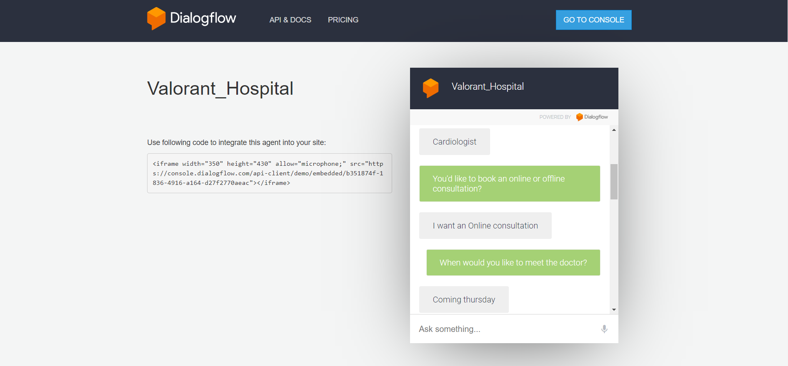
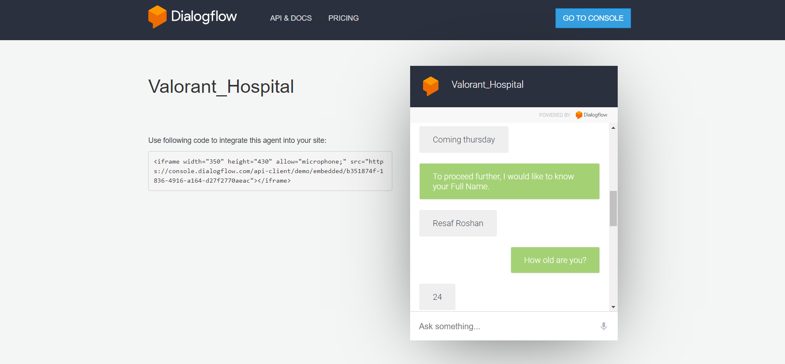
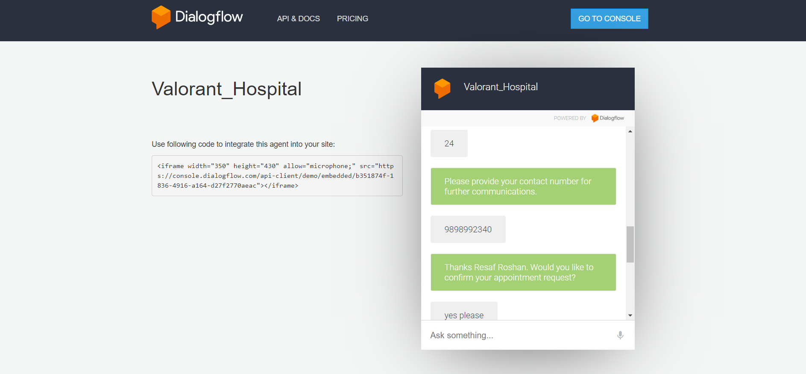
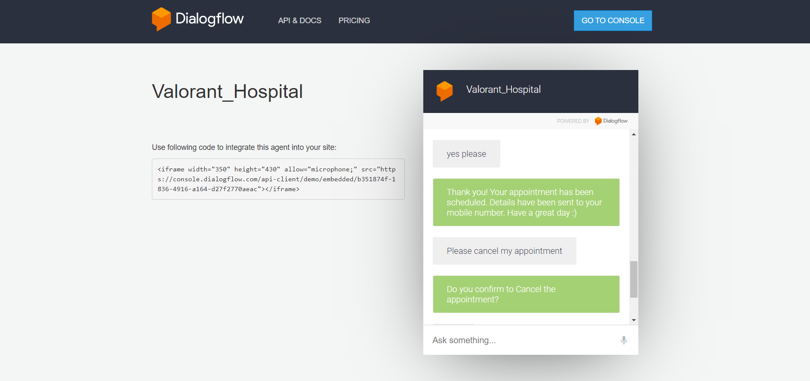
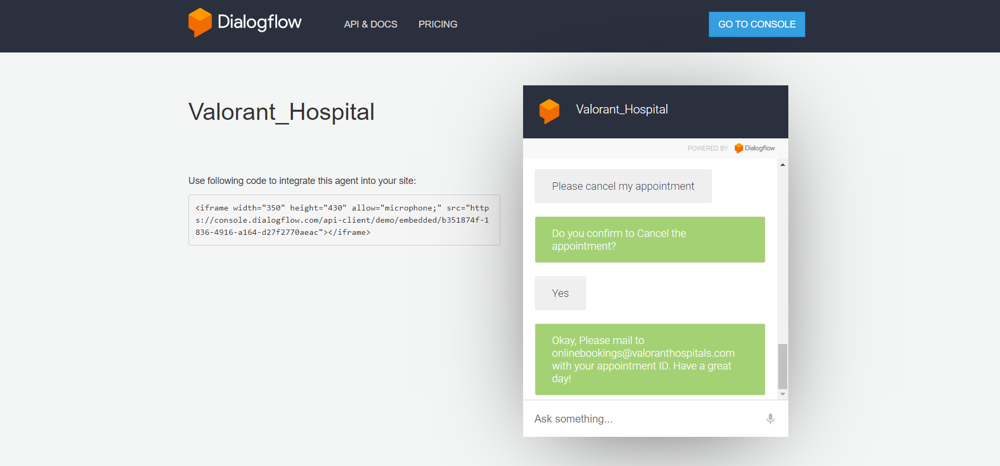
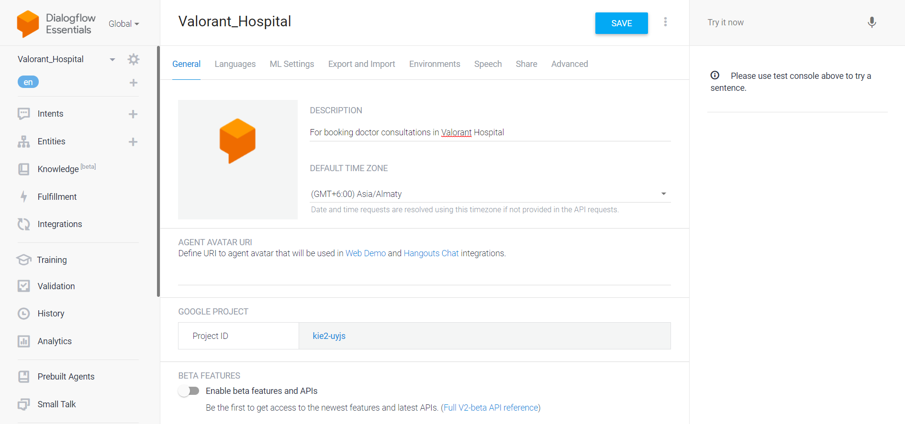
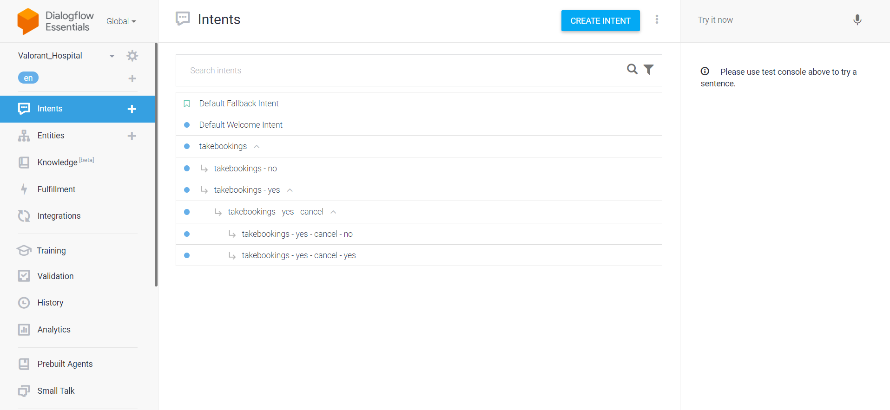
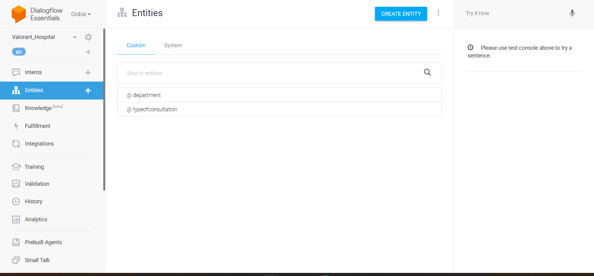
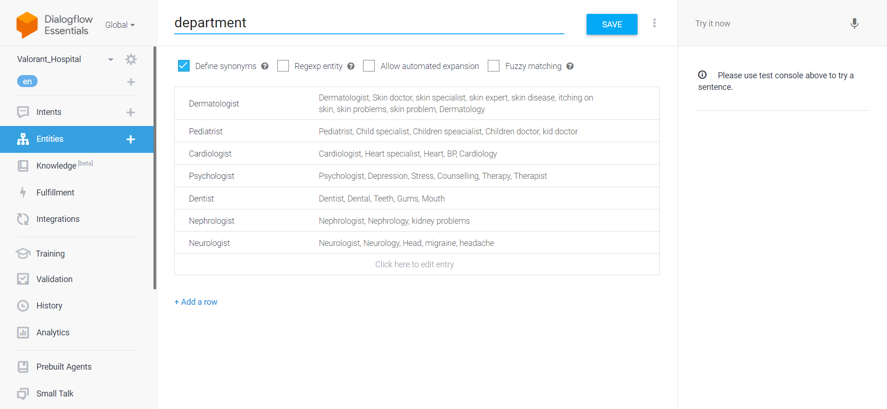
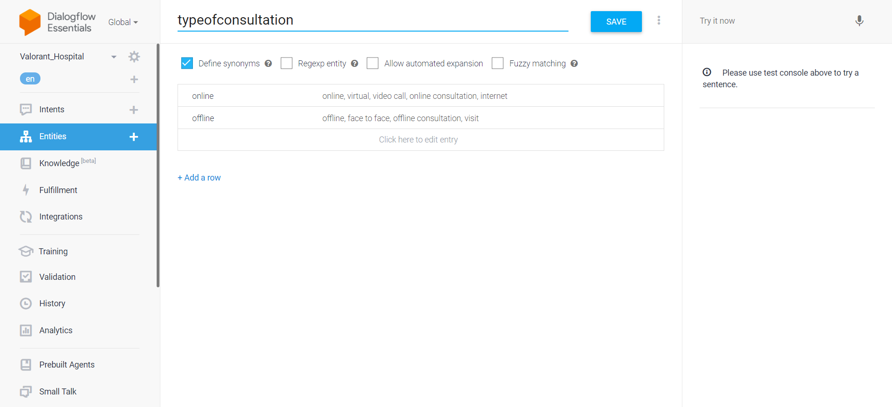

# Objective
This chatbot is built to reduce human efforts and automate booking consultations at the Hospital. This chatbot can be deployed at the Hospital itself

# Methodology
The entire process of booking appointments are studied and noted down to build this chatbot

# tools used
Google's DialogFlow platform is being used in entire process of the building process

# Link to access the chatbot
https://bot.dialogflow.com/b351874f-1836-4916-a164-d27f2770aeac

# Screenshots of functioning of this chatbot

Booking confirmed

Requesting chatbot to cancel the appointment

# Steps involved in creating chatbot
Step 1:- Creating an agent
I have created an agent named Valorant_Hospital, which is used to communicate with the end users

Step 2:- Creating and training intents

Step 3:- Creating Entities

Step 4:- Training each of the entities

