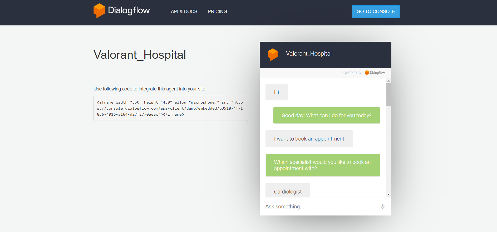
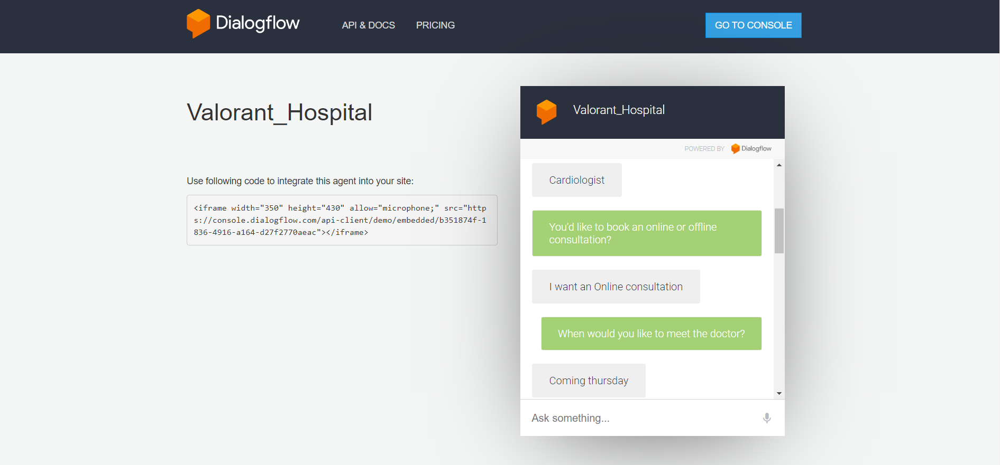
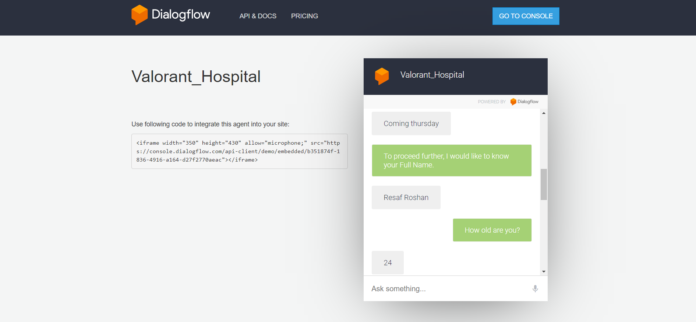
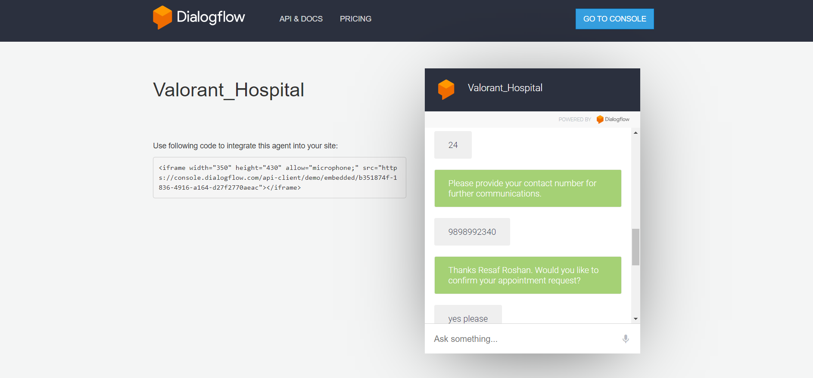
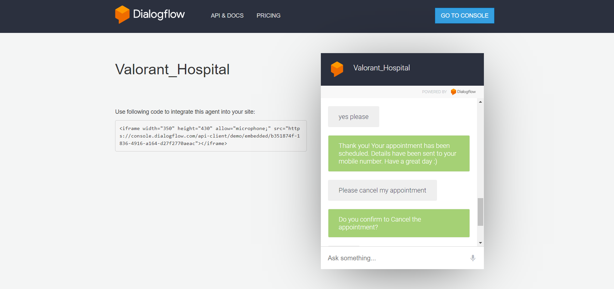
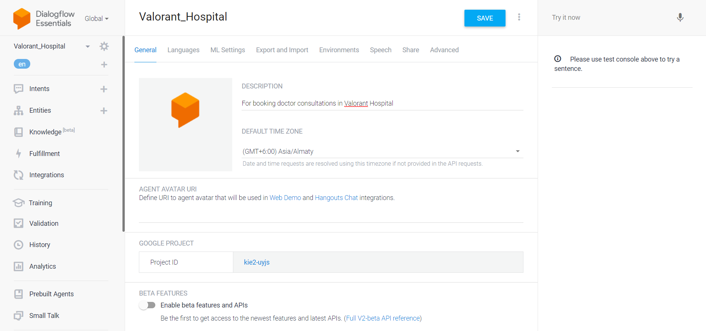
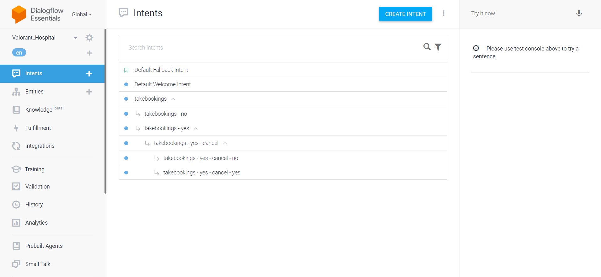
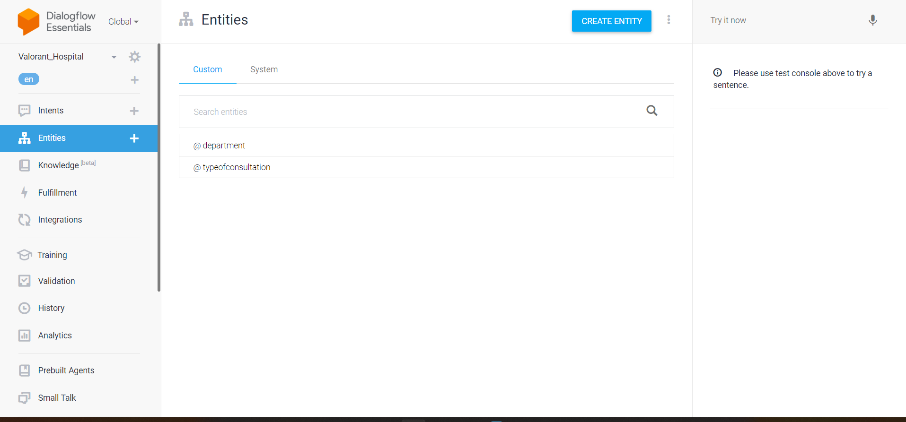
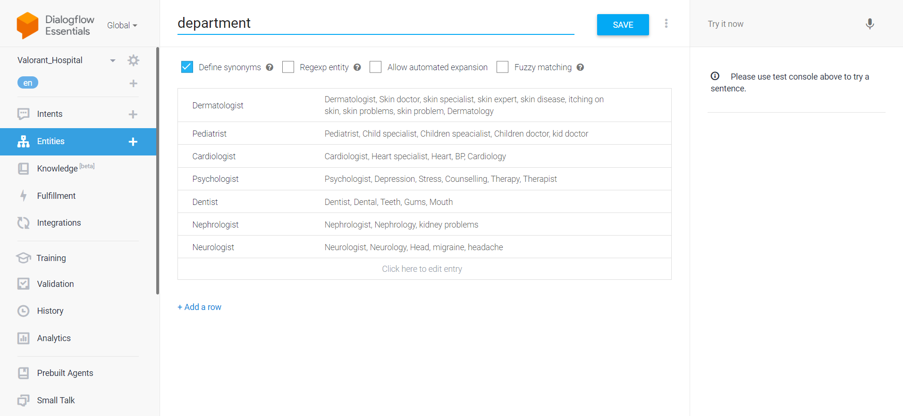

# Objective
This chatbot is built to reduce human efforts and automate booking consultations at the Hospital. This chatbot can be deployed at the Hospital itself

# Methodology
The entire process of booking appointments are studied and noted down to build this chatbot

# Tools used
Google's DialogFlow platform is being used in entire process of the building process

# Link to access the chatbot
https://bot.dialogflow.com/b351874f-1836-4916-a164-d27f2770aeac

# Screenshots of functioning of this chatbot

Booking confirmed

Requesting chatbot to cancel the appointment

# Steps involved in creating chatbot

Step 1: Creating an agent, I have created an agent named Valorant_Hospital, which is used to communicate with the end users

Step 2: Defining Entities Entities can be fields, data, or text describing just about anything — a time, place, person, item, number, etc. Using natural language processing (NLP), chatbots can extract entities from entries that users type in order to turn around accurate recommendations and answers.

Step 3: Intents Intent refers to the goal that customer has in mind when typing in a question or comment. While entity refers to the modifier the customer uses to describe their issue, intent is what they really mean. Here are my intents

Step 4: Training phrases Training phrases are example phrases for what end-users might type or say, referred to as end-user expressions. For each intent, you create many training phrases. When an end-user expression resembles one of these phrases, Dialogflow matches the intent.

Step 5: Actions and parameters Dialogflow sends an API interaction response for each step of slot filling. For each of these slot filling responses, the intent and action will be the same, and the parameters collected so far will be provided. When building an agent, we provide prompts that the agent will use to get parameter data from the end-user.

Step 6: Responses The responses available are Text, Option, Pause and Image. I used only the text response type which is used for ordinary text responses.

Creating and training intents

Actions and parameters used

Creating Entities

Training each of the entities

# Limitations
This chatbot requires lot more intents and entities to make it robust

# Learnings
Building simple chatbot using google dialogflow

# Submitted by
Resaf Roshan P M,
21MBMA48,
MBA (GEN) 2021-23

